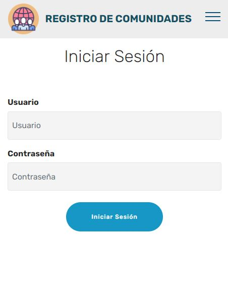
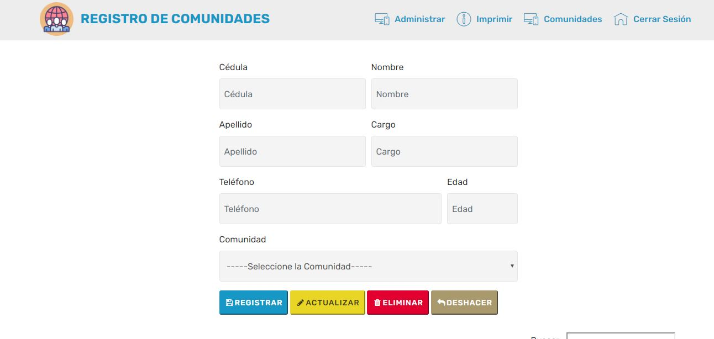
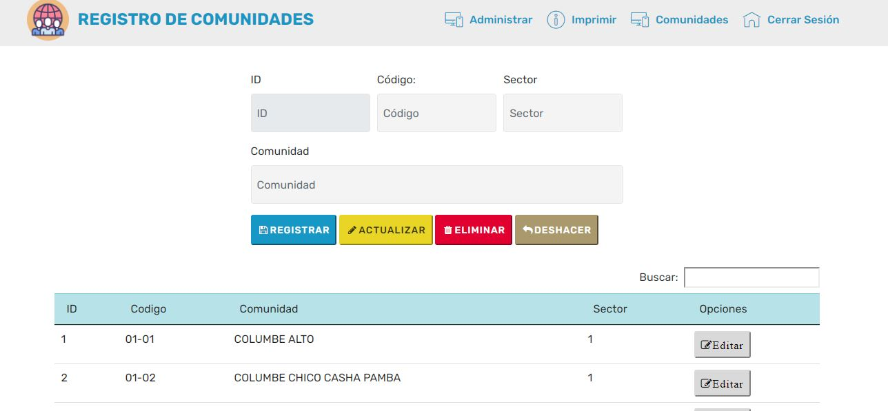

# Web-comunidades
```
Pequeño sistema web de control de Personas y Comunidades del GOBIERNO AUTÓNOMO DESCENTRALIZADO PARROQUIAL RURAL DE COLUMBE. 
Desarrollado con POO, JS, Bootstrap y backend con PHP
```

# Pantalla de Login:


# Home 


# Home Comunidades


